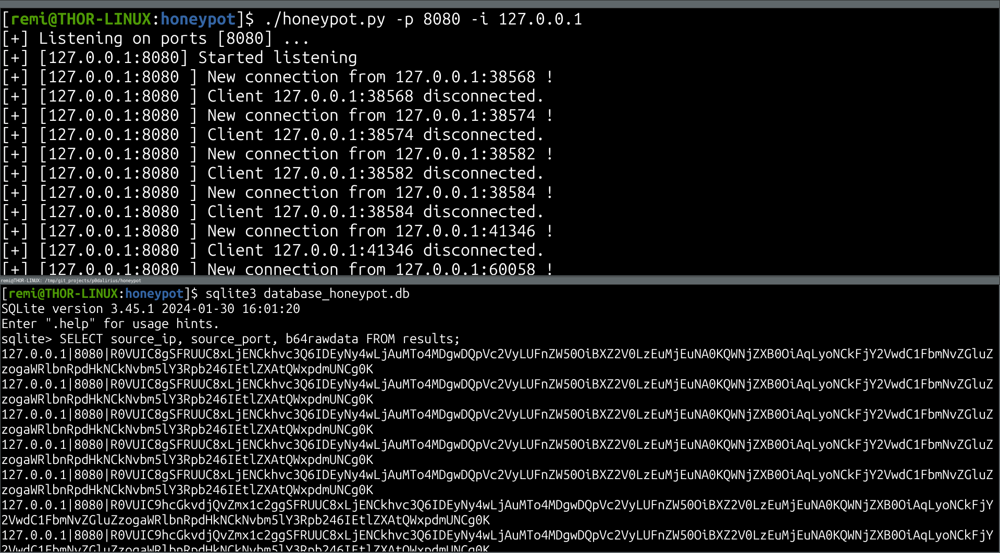

# A simple TCP Honeypot

<p align="center">
    A simple TCP Honeypot written in Python to keep a log of payloads and connections.
    <br>
    <a href="https://twitter.com/intent/follow?screen_name=podalirius_" title="Follow"></a>
    <a href="https://www.youtube.com/c/Podalirius_?sub_confirmation=1" title="Subscribe"></a>
    <br>
</p>


## Features

- [x] Multithreaded server
- [x] Monitoring multiple ports
- [x] Reports results in a SQLite3 database


## Usage

To start the honeypot server you just have to type this with the IP and port you want to listen on:

```
./honeypot.py -i 127.0.0.1 -p 8080 
```

Here is an example of parameters for listening `enp8s0` on tcp ports `8080`, `8081` and `8082`:

```
./honeypot.py -p 8080 -p 8081 -p 8082 -i enp8s0
```


## Demonstration




## Contributing

Pull requests are welcome. Feel free to open an issue if you want to add other features.

